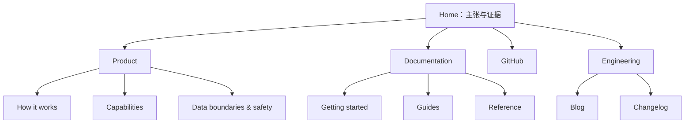
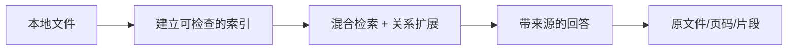

# Mneme 网站设计改造规范

**版本：** 2.0
**状态：** 已落地为可发布的静态站点
**审阅对象：** Mneme GitHub Pages 站点（英文/简体中文）
**设计目标：** 将「功能齐全但像默认文档站」的现状，重构为一个克制、可信、具有产品叙事能力的本地知识系统网站。

---

## 1. 结论与设计北极星

Mneme 不应被呈现成泛化的 AI 聊天工具，也不应被包装成云端 SaaS。它真正的价值是：**把用户自己的本地文档转化为可检索、可追溯、可检查的记忆。**

因此，新的核心主张为：

> **Mneme is local memory you can verify.**
> 将本地文档变成可查证的记忆。

新站的第一屏必须在 5 秒内让访客理解四件事：

1. Mneme 处理的是自己的本地文件，而不是云端知识库。
2. 它不仅能搜索，还能处理跨文档关系与复杂问题。
3. 每个答案可回到具体来源、页码或片段验证。
4. 它是开源、面向开发者的 Python CLI/TUI 工具，最快的下一步是阅读文档或查看源码。

**体验关键词：** 安静、笃定、学术感、工程感、可审计；避免“赛博紫色 AI 魔法”“玻璃拟态”“夸张渐变”和没有证据支撑的性能承诺。

---

## 2. 现状认知与问题定义

### 2.1 站点与项目事实

改造前的站点是一个 VitePress 静态文档站；当前发布面已经按本规范改为共享静态模板，保留的项目事实包括：

- 英文/简体中文双语、站内搜索、浅色/深色模式、GitHub 入口。
- 首页首屏、六个功能卡、安装命令与文档入口。
- Hybrid Retrieval（Sentence Transformers + ChromaDB + BM25/RRF）、Graph RAG、查询拆解、安全边界、双语终端 UI、广泛文件格式支持。
- 「稳定 `source_id` / `chunk_id` / hash」「原子 manifest」「未信任文档边界」「离线安全测试」等可信工程原则。
- 一张真实 TUI 截图，作为首页主证明材料。

### 2.2 保留项

| 资产 | 处理方式 | 理由 |
| --- | --- | --- |
| 文档路由、侧栏、站内搜索、语言入口 | 保留语义并重建为静态模板 | 对开发者学习路径有效，同时彻底移除旧 VitePress 视觉壳。 |
| `/guide`、`/features`、`/reference`、`/blog` 与中英文 URL | 保持 URL 不变 | 避免破坏外链、搜索收录与已有文档习惯。 |
| TUI 实拍/演示资源 | 强化为首页主视觉与交互证据 | 真实终端比抽象 AI 插画更能建立可信度。 |
| 安全页中的数据外发说明 | 前移为首页信任模块 | 这是 Mneme 的差异化，不应埋在深层文档中。 |

### 2.3 当前体验问题

| 优先级 | 发现 | 影响 | 改造决策 |
| --- | --- | --- | --- |
| P0 | 首页仍是 VitePress 默认 Hero + 功能卡的组合。 | 访客理解到“有六个功能”，却不理解这些功能如何共同产生可信答案。 | 改为“主张—证据—工作流—能力—信任—上手”的叙事。 |
| P0 | “本地处理”与“检索片段会发送至已配置 LLM endpoint”的边界不在首页。 | 容易造成“绝不离开机器”的误解，损害信任。 | 新增 Data Boundary 模块，使用精确文案。 |
| P1 | 视觉几乎全部依赖紫色渐变、圆角卡和 emoji。 | 品牌记忆点弱，且 emoji 与严肃的可验证/安全主题冲突。 | 建立纸张、石墨、墨紫、证据绿的专属系统；使用线性图标。 |
| P1 | 六张同权重卡片信息密、扫描成本高。 | 技术名词优先于用户结果。 | 聚合为三类能力，并以“问题—机制—证据”展开。 |
| P1 | 移动端隐藏 TUI 图片，但 Hero 仍保留大块图像区域。 | 390px 宽度下首屏出现明显空白，主张与行动被推迟。 | 移动端取消空图容器，改为可见的紧凑证据条。 |
| P2 | 导航以内容类型罗列，缺少“产品如何工作”的入口。 | 新访客只能靠猜测进入功能页。 | 将产品、文档、工程内容分层，增加 How it works。 |
| P2 | 文档页、博客页、首页缺少统一的内容节奏。 | 页面从“产品介绍”跳回“默认文档”，品牌中断。 | 使用同一 token、排版、代码块与页首模板。 |

---

## 3. Anthropic 参考方式与 Mneme 的转译

本项目参考 Anthropic 官网的**设计原则**，不复制其版式、插画、字体或品牌资产。可借鉴的方向是：以强而简洁的陈述建立可信主张；用编辑化大字号和大量留白组织阅读；让模块服务叙事而不是堆砌 UI；将安全、研究和产品当作同一可信体系来表达。Anthropic 的公开主页也把“安全”放在产品主张的中心，而不是仅作为页脚合规信息。[Anthropic 首页](https://www.anthropic.com/)  [Anthropic Company](https://www.anthropic.com/company)

Mneme 的转译规则如下：

| Anthropic 式原则 | Mneme 的具体表达 | 禁止项 |
| --- | --- | --- |
| 清晰、一句话的使命叙事 | “Local memory you can verify.” | “The best AI RAG platform”等空泛超强主张。 |
| 编辑化版面与空间节奏 | 纸张色背景、宽留白、窄阅读列、全宽证据段。 | 全屏渐变、满屏卡片墙。 |
| 可信、有分量的视觉语气 | 石墨文字、细分隔线、真实终端、来源标签与流程图。 | 卡通脑图、无意义粒子、伪 3D 芯片。 |
| 复杂系统的分层讲述 | 本地文件 → 索引 → 混合/图检索 → 带来源回答。 | 直接丢出 ChromaDB、BM25、RRF 的术语清单。 |
| 安全是产品体验的一部分 | 在首页展示数据边界；在功能页显示控制项与默认值。 | 以“100% 私密/永不发送”替代准确披露。 |

**定位差异：** Anthropic 面向通用 AI 的宏观可靠性；Mneme 应聚焦于个人/团队文档的微观可验证性。其美学应更接近“私人档案室 + 严谨终端”，而非企业营销网站。

---

## 4. 品牌与视觉系统

### 4.1 品牌概念

名称来自记忆女神 Mnemosyne。将品牌叙事收束为三层：

- **Memory / 记忆：** 文档不再是散落的文件，而是持续可访问的知识。
- **Evidence / 证据：** 回答不是黑箱，必须附带可定位的来源。
- **Sovereignty / 自主：** 索引和检索发生在用户定义的本地边界内。

主图形语言是「被索引的记忆」：文件页、节点、引文锚点和细连接线。线条应稀疏、可读、具有结构性；它们描述关系，不能充当纯装饰。

### 4.2 色彩 token

| Token | Light | Dark | 用途 |
| --- | ---: | ---: | --- |
| `--mn-surface-canvas` | `#F5F0E7` | `#161512` | 页面底色：温暖纸张/深石墨。 |
| `--mn-surface-raised` | `#FFFCF6` | `#201F1B` | 卡片、代码容器、浮层。 |
| `--mn-text-primary` | `#211F1A` | `#F4EFE7` | 标题与关键正文。 |
| `--mn-text-secondary` | `#5E584E` | `#BFB7AA` | 正文、说明、元信息。 |
| `--mn-line-subtle` | `#DDD4C6` | `#3A3731` | 1px 分隔、表格线、图形线。 |
| `--mn-memory-600` | `#69439B` | `#B89AF0` | 品牌锚点、链接、主按钮。 |
| `--mn-memory-100` | `#EEE6FB` | `#2E2440` | 低强调背景、标签。 |
| `--mn-evidence-600` | `#286653` | `#7BD0B5` | 引文、已验证状态、来源锚点。 |
| `--mn-boundary-600` | `#9B4D3A` | `#F0A28C` | 数据边界、警示但非报错。 |

紫色只用于“Mneme/记忆/交互焦点”，不再承担整页渐变背景。绿色只表示证据与已验证状态，不能用于成功提示以外的含义。颜色文字均须达到 WCAG AA 对比度。

### 4.3 字体与排版

- **展示标题：** `Newsreader, "Noto Serif SC", "Songti SC", serif`。用于首页主张、章节题；有档案与思想的气质。
- **正文与 UI：** `Inter, "Noto Sans SC", "PingFang SC", sans-serif`。保持现有高可读性与中英文一致性。
- **代码与数据：** `"JetBrains Mono", "Fira Code", ui-monospace, monospace`。用于 CLI、来源 ID、指标与架构图标签。
- 中文不要强制使用网络字体；优先系统字体，英文展示字体可本地自托管并使用 `font-display: swap`。

| 层级 | 桌面 | 移动端 | 用法 |
| --- | --- | --- | --- |
| Display | 76–88px / 0.96 | 42–48px / 1.05 | 首页核心主张，仅 2–4 行。 |
| H1 | 56–64px / 1.05 | 36–40px / 1.15 | 功能、文档 landing 页。 |
| H2 | 36–44px / 1.15 | 28–32px / 1.2 | 页面大模块。 |
| H3 | 22–24px / 1.25 | 20–22px / 1.3 | 卡片与子章节。 |
| Body L | 20px / 1.5 | 18px / 1.55 | Hero/导语。 |
| Body | 16px / 1.65 | 16px / 1.65 | 正文。 |
| Meta | 12–13px / 1.4 | 12–13px / 1.4 | 标签、来源、日期。 |

### 4.4 布局、边框与间距

- 桌面采用 12 列网格，最大内容宽 `1280px`；常规外边距 `48px`，1440px 以上为 `64px`。
- 文章阅读列最大 `720px`；正文不与宽图使用同一列。
- 基础间距单位为 `4px`，常用阶梯为 8 / 12 / 16 / 24 / 32 / 48 / 64 / 96 / 128。
- 圆角克制：卡片 `12px`，按钮 `999px`，终端与内容面板 `16px`。不把所有容器都做成胶囊。
- 使用 `1px` 实线与留白分组；阴影只用于浮层和可点击的高层级面板，且低对比度。

---

## 5. 信息架构与导航

### 5.1 顶级导航

| 英文 | 中文 | 目标 | 内容 |
| --- | --- | --- | --- |
| Product | 产品 | 解释产品价值 | How it works、Capabilities、Data boundaries。 |
| Documentation | 文档 | 让用户安装、配置、查 API | Getting Started、Configuration、TUI、Reference。 |
| Engineering | 工程 | 沉淀方法与版本 | Blog、Changelog、架构文章。 |
| GitHub | GitHub | 源码与社区 | 外链，使用 GitHub 标识。 |
| Language | 语言 | 人工选择 locale | EN / 简体中文；保留当前路径映射。 |

移动端仅保留 Logo、搜索、菜单；菜单打开后按上述三组显示，底部固定 `View on GitHub`。主题切换置于菜单设置区，不抢占顶部。

### 5.2 网站地图



`Product` 可以是首页锚点集合，无需在第一阶段新增 SPA 或复杂后台。所有既有 Markdown 页面继续作为权威内容源。

---

## 6. 首页完整方案

### 6.1 页面叙事顺序



这个流程应成为首页的认知主线；技术名词在访客理解流程之后出现。

### 6.2 模块规格

| # | 模块 | 内容与结构 | 视觉/交互 |
| --- | --- | --- | --- |
| 01 | 顶部导航 | Logo、Product、Documentation、Engineering、GitHub、语言、搜索。 | 背景透明；滚动超过 48px 后显示纸张色与细底线。 |
| 02 | Hero | Eyebrow：`LOCAL-FIRST · EVIDENCE-BACKED`；H1：`Your documents. A memory you can verify.`；正文说明本地索引、关系检索和来源可追溯；CTA。 | 左侧大字，右侧是真实 `tui-real-screenshot.png` 终端帧；底部三枚证据标签。 |
| 03 | Proof strip | `Local index` / `Source citations` / `Explicit data boundary`，每项一句不超过 16 个英文词。 | 全宽深石墨底，使用细线图标与编号 `01–03`。 |
| 04 | How it works | 四步：Add files、Build memory、Ask across documents、Inspect the evidence。 | 横向流程图；每步有小型真实 UI/代码片段，移动端纵向。 |
| 05 | Capability triptych | `Find what matters`、`Follow the connections`、`Stay in control`。 | 三个不等高编辑化栏目，不用六格同款卡。每栏含结果、支撑技术、深链。 |
| 06 | Evidence demo | 一个具体问答：问题、回答要点、S1/S2/S3 引文与文件页码。 | 如论文页边注；点击来源展开文件/页码信息，静态版本也能跳到示例说明。 |
| 07 | Data boundary | 两列：`Always local` 与 `Sent to your configured endpoint when used`。 | 有明显边界线和精确披露；链接到 Safety 文档。 |
| 08 | File support | `PDF · DOCX · Markdown · HTML · JSON · CSV · Code · Config`；链接完整列表。 | 单行/可换行的等宽文件标签，避免大图标墙。 |
| 09 | Developer start | 3–5 行可复制命令，不放整段安装教程。 | 深色代码框、平台切换（Windows / macOS & Linux）和 `Read the guide`。 |
| 10 | Closing CTA / footer | `Build a memory you can inspect.` + Docs / GitHub。 | 大留白、细分隔；footer 按 Product / Docs / Engineering / Community 分组。 |

### 6.3 Hero 文案

**英文（默认）：**

```text
LOCAL-FIRST · EVIDENCE-BACKED

Your documents.
A memory you can verify.

Mneme indexes your local files, retrieves what matters, and returns answers
you can trace back to the source.

[ Read the documentation ]  [ View on GitHub ↗ ]

Local index     Source-linked answers     Python CLI + TUI
```

**简体中文（非逐字翻译）：**

```text
本地优先 · 证据可查

你的文档，
一套可验证的记忆。

Mneme 在本地建立索引，找回关键内容，并让每个回答回到可查的来源。

[ 阅读文档 ]  [ 在 GitHub 查看 ↗ ]

本地索引     回答附来源     Python CLI + TUI
```

不要在 H1 中同时堆入 “Graph RAG”“BM25”“ChromaDB”。这些词应出现在第 5 模块的技术说明与深链中。

### 6.4 Hero 线框

```text
┌───────────────────────────────────────────────────────────────────────┐
│ MNEME       Product  Documentation  Engineering    GitHub  EN  Search │
├───────────────────────────────────────────────────────────────────────┤
│ LOCAL-FIRST · EVIDENCE-BACKED                                         │
│                                                                         │
│ Your documents.                      ┌─────────────────────────────┐  │
│ A memory you can verify.              │  Mneme TUI                  │  │
│                                        │  Q: What changed...?        │  │
│ Local index · retrieve · cite          │  A: ... [S1] [S2]           │  │
│ [Read docs] [View GitHub]              │  Sources: report.pdf p.12   │  │
│                                        └─────────────────────────────┘  │
│ Local index     Source citations     Explicit data boundary             │
└───────────────────────────────────────────────────────────────────────┘
```

右侧终端的最小展示宽度为 `420px`。低于 `768px` 时，不隐藏内容也不保留空白：改为标题下的 `source-linked answer` 紧凑证据条，或显示终端卡顶部 7–9 行。

---

## 7. 功能页、文档页与博客页

### 7.1 产品/功能页模板

每个功能页（Hybrid Retrieval、Graph RAG、Query Decomposition、Safety）按以下固定叙事改造：

1. **页首：** 功能名、一个用户问题、30–50 字价值描述、本文目录。
2. **What it solves：** 具体失败模式，例如“只依赖向量检索会错过精确术语”。
3. **How Mneme handles it：** 用一张流程示意和 3 条机制说明，技术术语可展开。
4. **What you can inspect：** 展示 citation、index fingerprint、manifest 或安全边界等可观察证据。
5. **Configure / Try it：** 最小命令、配置链接。
6. **Related reading：** 下一步功能或参考页，而非孤立的上一篇/下一篇。

**Graph RAG 页面示例：** 用“跨多个会议纪要，某项决策为何改变？”作为问题；用节点—关系—证据源图说明关系扩展；明确关系来自 LLM 提取、图缓存需要与 index fingerprint 匹配。

### 7.2 文档页模板

- Desktop 使用左侧分组导航、中间 680–720px 阅读列、右侧本页目录；3 栏总宽不超过 `1440px`。
- 页首新增面包屑、文档类型标记（Guide / Reference / Feature）、阅读时间或“更新于”。
- 代码块顶部显示语言与复制按钮；命令块支持 Windows 与 macOS/Linux 标签，不在同一块里混排两套命令。
- 表格允许横向滚动，表头保持高对比背景，移动端不可压缩到难读。
- 将“Edit this page on GitHub”放在文档结尾的贡献区，而不是与主要阅读操作竞争。

### 7.3 博客与工程内容

- Blog 使用编辑文章页：分类、发布日期、读时、作者，正文 `720px`，插图或代码可溢出至 `960px`。
- 工程文章的顶部附“本文涉及：Hybrid Retrieval / Graph RAG / Safety”标签，标签可跳转对应文档。
- Changelog 使用版本号、日期、`Added / Changed / Fixed / Security` 四类标记，避免长段落。

---

## 8. 核心组件规范

| 组件 | 定义 | 状态与细节 |
| --- | --- | --- |
| `MnemeButton` | Primary（墨紫底）/ Secondary（透明细框）/ Text link。 | 高度 44px；焦点环 `3px` memory 色；只使用一个 Primary CTA/区域。 |
| `EvidenceChip` | 例如 `S1 · report.pdf · p.12`。 | 等宽 `S1`，证据绿点；hover 显示来源摘要；键盘可聚焦。 |
| `DataBoundary` | `Local` / `Configured endpoint` 两列说明。 | 无欺骗性免责声明；始终使用静态文本作为无 JS 降级。 |
| `TerminalFrame` | 真正的 TUI SVG/截图和可复制文本备选。 | 16px 圆角、深色、可见标题栏；图片必须有描述性 alt。 |
| `CapabilityPanel` | 结果标题、1 句说明、机制、深链。 | 最多三个/行；hover 仅轻微上移 2px 与边线变色。 |
| `StepRail` | 01–04 工作流步骤。 | 连接线是真正步骤关系；移动端变为左侧竖线。 |
| `Callout` | Note / Safety / Evidence。 | 不只依赖颜色，含图标、标题与可读标签。 |
| `CodeBlock` | 安装、配置、命令。 | 不截断；复制后显示文本反馈；遵从深色主题。 |

图标使用统一 1.5px 描边的自绘 SVG（文件、索引、节点、引文、边界），替换 emoji。所有有意义图标带文本或 `aria-label`。

---

## 9. 交互、响应式与无障碍

### 9.1 交互原则

- 首屏动画只允许终端光标轻闪或连接线逐步显现；总时长 `≤ 600ms`，不能阻碍阅读。
- 不使用自动轮播、连续粒子、视差大图或滚动驱动的复杂特效。
- `prefers-reduced-motion: reduce` 时，禁用位移、光标和连线动画。
- 锚点链接滚动后标题不能被固定导航遮住；`scroll-margin-top` 至少为导航高度 + 24px。
- 搜索使用原生 `dialog` 与站点索引，触发键在 Windows 显示 `Ctrl K`、macOS 显示 `⌘ K`。

### 9.2 断点

| 宽度 | 布局规则 |
| --- | --- |
| `≥ 1280px` | 12 列；Hero 7:5；文档使用三栏。 |
| `960–1279px` | 8–12 列弹性；Hero 文字与终端保持双栏；文档右侧目录可折叠。 |
| `768–959px` | Hero 变 1:1 或纵向；能力区双列；导航收窄。 |
| `≤ 767px` | 16–24px 侧边距；单列；终端变紧凑卡；顶部仅 Logo/搜索/菜单。 |
| `≤ 390px` | 主 CTA 可换行但仍 44px 高；不出现被隐藏媒体留下的空白；长文件名允许中间截断。 |

### 9.3 无障碍验收标准

- 满足 WCAG 2.2 AA：正文和控件对比度至少 4.5:1，大号字至少 3:1。
- 所有可点击对象最小命中区域 `44 × 44px`；卡片若整体可点击，内部不嵌套第二个链接。
- 提供可见 `:focus-visible`，保留跳到正文链接，焦点顺序等于视觉阅读顺序。
- 终端截图 `alt` 要描述能证明什么，例如“Mneme TUI 展示回答及 report.pdf p.12 的来源标记”，不能只写 “screenshot”。
- 图表提供 HTML 等价说明；颜色、动效、hover 都不是唯一信息通道。
- 中英文 `lang`、页面标题、搜索按钮和语言切换的可访问名称完整本地化。

---

## 10. 内容与可信度规则

### 10.1 首页必须准确披露的数据边界

建议采用以下文案，而非笼统的 “private by default”：

```text
Always local
• File discovery, parsing, indexing, vector/BM25 retrieval, and cache management.

When an LLM-backed feature is used
• Retrieved snippets are sent to the endpoint you configure for answer generation,
  query decomposition, or Graph RAG entity extraction.
```

中文：

```text
始终在本地
• 文件发现、解析、索引、向量/BM25 检索与缓存管理。

使用 LLM 能力时
• 在生成回答、查询拆解或 Graph RAG 实体提取时，检索出的片段会发送至你配置的端点。
```

### 10.2 文案规则

- 先讲用户能检查到的结果，再讲内部技术：`Answer with sources` 在 `BM25 + RRF` 之前。
- 用 “can / helps / designed to” 描述能力；不使用无法证明的 “always accurate”“hallucination-free”“100% secure”。
- 对有默认值的安全控制，写出默认值和单位，例如文档大小 `50 MiB`、PDF `2000 pages`；并链接到配置来源。
- 中英文都以自然表达为准。中文不翻译产品名、CLI 命令、环境变量、文件格式；`Graph RAG` 可保留英文并首次补充说明。

---

## 11. 前端实施蓝图

### 11.1 技术策略

本次交付采用无依赖的语义 HTML、CSS 和少量原生 JavaScript，直接面向 GitHub Pages 发布。这样可以彻底删除旧的 VitePress 构建产物，避免首页与文档页再次出现两套视觉系统；clean URL 仍保留原有 `/guide`、`/features`、`/reference`、`/blog` 和中英文路径。

实际站点结构：

```text
MNEME/
  index.html / zh/index.html       # 英文/中文首页
  mneme-site.css                   # 共享 token、页面模板与响应式规则
  mneme-site.js                    # 主题、菜单、搜索、复制与平台切换
  guide/ features/ reference/ blog # 按规范重建的静态内容页
  mneme-logo.svg
  tui-real-screenshot.png          # 真实 TUI 证据图
```

`assets/`、`vp-icons.css`、`hashmap.json`、旧 hash CSS/JS 和旧 VitePress HTML 不属于新的发布面，均应删除而不是继续覆盖。

### 11.2 实施细节

1. 在 `mneme-site.css` 以 CSS custom properties 定义第 4 节 token；浅色/深色通过同一套变量切换，不为每个页面散落写色值。
2. 每个页面使用语义 HTML 输出：`header`、`main`、`section`、`article`、`figure`、`nav`、`footer`；文档页使用统一的侧栏、阅读列与本页目录。
3. 英文和中文页面分别编写自然文案，保留产品名、CLI 命令、环境变量和文件格式，不使用 DOM 翻译替换。
4. 首页使用真实 `tui-real-screenshot.png`，固定 `width`、`height`、`decoding="async"` 和描述性 `alt`；移动端缩小为紧凑终端帧而非留下空白图槽。
5. 搜索、主题、菜单、复制和平台切换仅使用原生 JavaScript；图标采用 CSS 线性形状，避免引入全量 icon library。
6. 首页安装命令与 Getting Started 页面保持同一套命令语义，Windows 与 macOS/Linux 分开展示。
7. 保留既有 clean URL 的语义路径，但以全新 HTML 内容替换旧 VitePress 产物；不再保留旧 hash 静态资源。

### 11.3 性能预算

| 项目 | 目标 |
| --- | --- |
| 首屏图片总传输 | 低于 250 KB（优先 SVG 或现代格式）。 |
| 非必要 JavaScript | 首页不新增依赖型动画库。 |
| 字体 | 关键字体仅一套；优先本地/系统字体；`font-display: swap`。 |
| Lighthouse（移动模拟） | Performance ≥ 90、Accessibility ≥ 95、Best Practices ≥ 95、SEO ≥ 95。 |
| CLS | ≤ 0.05；所有媒体预留尺寸。 |
| LCP | 文字为主 LCP；若为视觉资源，加载优先级明确。 |

---

## 12. 分阶段改造与优先级

| 阶段 | 产出 | 优先级 | 完成定义 |
| --- | --- | --- | --- |
| 0. 内容校准 | 首页主张、数据边界、双语术语表 | P0 | 产品技术负责人确认所有安全/本地化描述真实无误。 |
| 1. Design tokens | 色彩、字体、间距、按钮、代码、导航规范 | P0 | 浅/深色 token 与组件故事页完成；不再出现散落色值。 |
| 2. 首页重构 | 新 Hero、proof strip、流程、三能力、证据演示、数据边界、CTA | P0 | 访客可在首屏和一次滚动内回答第 1 节四个问题。 |
| 3. 文档壳层 | 共享导航、侧栏、文档页、代码块、原生搜索外观 | P1 | Guide/Reference 在中英文与移动端均可用。 |
| 4. 功能/博客模板 | 四个功能页与文章页的统一模板 | P1 | 至少 Hybrid Retrieval、Graph RAG、Safety 完成迁移。 |
| 5. 质量发布 | 响应式、a11y、性能、SEO、视觉回归 | P0 | 通过第 13 节验收；发布不破坏旧链接。 |

### 风险控制

- **真实性风险：** 所有“本地”“安全”“来源”文案先对照实现与安全文档；不以营销语替代边界声明。
- **范围膨胀：** 第一阶段只新建首页模板和主题壳，不重写所有 Markdown 正文。
- **i18n 风险：** 英文和中文分别编写 Hero/CTA，不能依赖自动翻译；检查中英文的路径、搜索、标题和 Open Graph。
- **静态站风险：** 先在源仓库构建预览；不要手改已发布产物来获得一次性视觉效果。

---

## 13. 交付验收清单

### 产品与内容

- [ ] 首屏说明本地索引、可验证来源、CLI/TUI、文档/源码下一步。
- [ ] 首页明确写出 LLM 功能使用时的检索片段外发边界。
- [ ] `Hybrid Retrieval`、`Graph RAG`、`Query Decomposition`、`Safety` 都有可抵达入口。
- [ ] 真实 TUI 视觉是主证明材料，非装饰性 AI 插画。
- [ ] 首页中英文本分别自然、无乱码、无英文特有行长破坏中文布局。

### 视觉与响应式

- [ ] 在 1440、1024、768、390px 宽度下验证 Hero、导航、CTA、卡片和代码块。
- [ ] 390px 下无空白图像槽；关键 CTA 在首屏或一次短滚动内可见。
- [ ] 浅色与深色模式下颜色、图标、代码块和边线均有足够对比。
- [ ] 不使用 emoji 作为功能系统的唯一图标。
- [ ] 所有页面共享标题、正文、链接、代码和分隔线节奏。

### 工程与质量

- [ ] 使用源仓库主题文件实现，未直接维护 hash 文件名的构建产物。
- [ ] 本地搜索、主题切换、语言切换、文档编辑链接、旧 URL 都可用。
- [ ] 键盘可操作菜单、搜索、主题和所有 CTA；焦点可见。
- [ ] `prefers-reduced-motion` 有效；无自动播放/高成本动效。
- [ ] 图片均带尺寸和可访问的替代文本；无严重控制台错误。
- [ ] 通过 Lighthouse 预算与视觉回归截图检查后再部署。

---

## 14. 设计交付物清单

开始实现前，应输出以下可审阅材料：

1. 本文档对应的桌面与移动端首页高保真稿（浅色、深色各一）。
2. `tokens.css` / Figma variables：颜色、字体、间距、阴影、圆角、断点。
3. Hero、Evidence chip、Data boundary、Terminal frame、Capability panel、Code block 的组件状态稿。
4. 中英文内容表与术语表。
5. 首页与三类文档模板的交互标注（focus、hover、reduced motion、移动菜单）。
6. 静态 HTML 模板、共享 CSS/JS 的实现任务拆分和第 13 节验收记录。

最终的评价标准不是“看起来更像 Anthropic”，而是：**Mneme 是否终于以自己的语气，让开发者一眼相信它能把本地文档变成可验证的记忆。**
